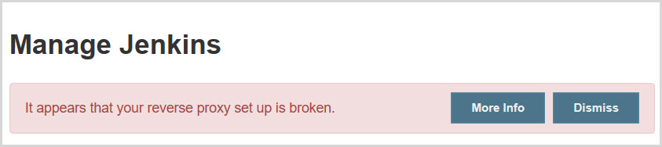
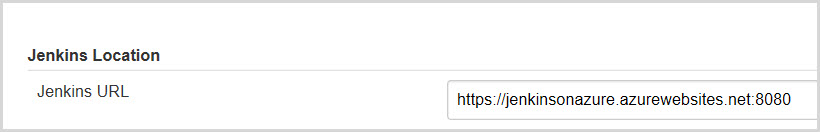
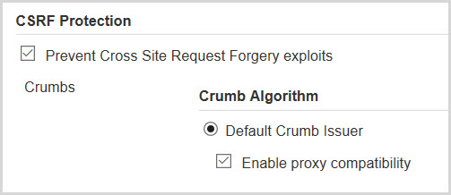

# Jenkins on Azure Web App for Containers

A Docker solution for Jenkins on Azure App Service for Containers. 

Jenkins is a self-contained, open source automation server which can be used 
to automate all sorts of tasks related to building, testing, and delivering 
or deploying software.

- [Overview](#overview)
- [Base image](#base-image)
- [SSH support](#ssh-support)
- [Persistent Files](#persistent-files)
- [Gotchas](#gotchas)
- [References](#references)

<a id="overview"></a>
## Overview

With the general availability of Azure Web App for Containers in 2017, 
SNP undertook an initiative to port a variety of applications running in
Linux VM's to Docker containers running in the new App Service for Linux. 
Our Jenkins workload is one such application.

Generally speaking, one can run just about any Docker, Linux container in
Azure Web App for Containers. We describe below considertions we took into account
for this Jenkins solution.

<a id="base-image"></a>
## Base image

We use the official Jenkins Docker image available on Docker Hub:
https://hub.docker.com/r/jenkins/jenkins.

`FROM jenkins/jenkins:lts`

This is a fully functional [Jenkins instance](https://jenkins.io/).

<a id="ssh"></a>
## SSH support

SSH enables secure communication between a container and a client. 
In order for a custom Docker image in Azure Web App for Containers to support SSH, 
you must build it into a Dockerfile. You enable SSH in the Docker file itself.

In the context of Web App for Containers, SSH is necessary to install the Jenkins UI.

For this purpose we followed [instructions in the Microsoft documentation](https://docs.microsoft.com/en-us/azure/app-service/containers/tutorial-custom-docker-image#connect-to-web-app-for-containers-using-ssh).

The customization include:

* Several lines added to our Dockerfile
```
RUN apt-get update -y
RUN apt-get install openssh-server -y
RUN echo "root:Docker!" | chpasswd \
    && echo "cd /home" >> /etc/bash.bashrc

COPY sshd_config /etc/ssh/
...
EXPOSE 2222
```

* A `sshd_config` file copied to `/etc/ssh/`
* `service ssh start` command in the entrypoint shell script `jenkins.sh`

<a id="files"></a>
## Persistent Files

In order to persist Jenkins data, we utilize the Web App's /home directory that is mounted 
to Azure File Storage (see NOTE below). 

To make our Azure data persistent, we install Jenkins in `/home/jenkins_home`. 
In the Dockerfile, the relevant lines are:
```
RUN mkdir -p /home/jenkins_home
ENV JENKINS_HOME /home/jenkins_home
```
NOTE: By default, the Web App for Containers platform mounts an SMB share 
to the /home/ directory. You can do that by setting the 
`WEBSITES_ENABLE_APP_SERVICE_STORAGE` app setting to "true" in the Application settings 
blade of the Web App.

IMPORTANT: Manually create the `jenkins_home` directory in the Web App `/home` directory  
_before_ you run the container and install Jenkins. This can be done from the Kudu Bash screen 
or from an FTPS session.

<a id="gotchas"></a>
## Gotchas

At the "Create First Admin User" step of the Jenkins installation process (Figure 1), you may be shown the  message 
'No valid crumb was included in the request'. Bypass this issue by clicking the "Continue as admin" link 
instead of the "Save and Continue" button (Figure 2). 

Once in Jenkins:

1. You may see an error message that reads, "It appears that your reverse proxy set up is broken." (Figure 3) 
Go to the "Configure System" screen (/configure), scroll down to the Jenkins UTL setting, append port 8080 to the 
URL - e.g. https://mysitename.azurewebsites.net:8080 (Figure 4) , click Apply, then click Save.

2. Next, Go to the "Configure Global Security" screen (/configureSecurity), scroll down to the "Prevent Cross Site Require Forgery exploits"
section, enable "Enable proxy compatibility", click Apply, then click Save (Figure 5).

3. Now you can update the admin user configuration at /user/admin/configure.

**Figure 1**


**Figure 2**


**Figure 3**



**Figure 4**



**Figure 5**



<a id="references"></a>
## References

1. [Docker Hub official repository for Jenkins](https://hub.docker.com/r/jenkins/jenkins)
2. [GitHub site for the repository image code](https://github.com/jenkinsci/docker)
3. [Connect to Web App for Containers using SSH](https://docs.microsoft.com/en-us/azure/app-service/containers/tutorial-custom-docker-image#connect-to-web-app-for-containers-using-ssh)
4. [SSH support for Azure App Service on Linux](https://docs.microsoft.com/en-us/azure/app-service/containers/app-service-linux-ssh-support)
5. [Understanding the Azure App Service file system](https://github.com/projectkudu/kudu/wiki/Understanding-the-Azure-App-Service-file-system)
6. [Azure App Service on Linux FAQ](https://docs.microsoft.com/en-us/azure/app-service/containers/app-service-linux-faq)
7. [Administering Jenkins](https://wiki.jenkins.io/display/JENKINS/Administering+Jenkins)
